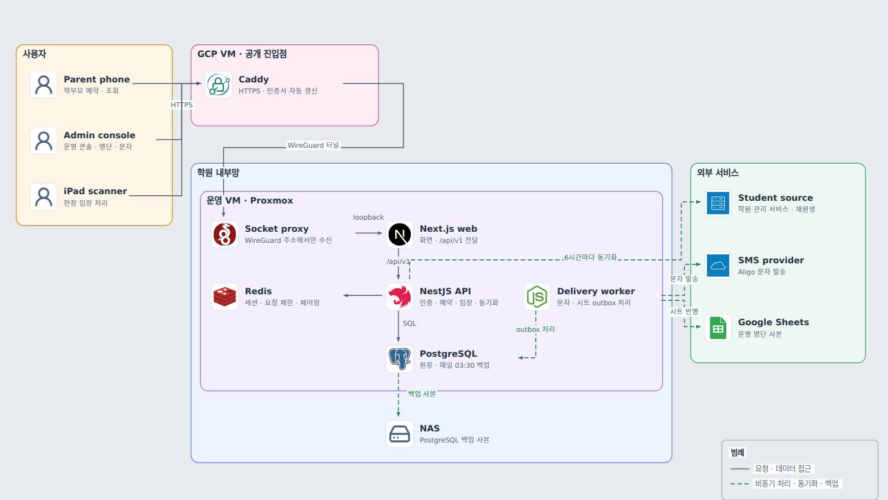

# npr-seminar

학원 입시설명회의 학부모 모바일 예약, 현장 QR 입장, 운영 콘솔을 묶은 예약·입장 시스템. 학부모는 계정 없이 문자 인증으로 예약하고, 행사 당일 입구의 iPad 스캐너가 가족 단위 QR을 읽어 입장을 기록함. 설명회를 마친 뒤 서비스를 종료함.

- 프로젝트 소개(대문): https://gjaku1031.github.io/ken-blog/post/project-d2ef2e0b-2e15-4aee-9454-88b4d5a00172/

## 주요 기능

| 기능 | 할 수 있는 일 |
| --- | --- |
| 모바일 예약 | 학부모가 캠퍼스·회차를 고르고 문자 인증 후 자녀를 선택해 예약. 비재원생은 이름·학교·학년으로 예약 |
| 예약 조회·변경·취소 | 문자로 받은 예약 링크에서 연락처를 확인해 예약과 QR을 다시 보고, 참석 학부모 변경·회차 이동·취소 |
| 현장 입장 | 입구의 iPad가 페어링 코드로 스캐너가 되어 QR을 읽고 실제 입장 인원을 기록. QR이 없으면 연락처 뒤 네 자리로 찾고, 예약 없이 온 가족은 현장 예약 후 입장 |
| 예약 명단·통계 | 회차별 재원생 명단에서 예약·입장·로그를 보고, 학생 수·가족 예약 수·실제 참석 인원을 캠퍼스·단위별로 확인. 엑셀 내보내기 |
| 문자 발송 | 템플릿을 편집하고 대상별로 미리보기 후 발송. 예약 확정·변경·취소 문자는 자동 발송 |
| 재원생 동기화 | 학원 관리 서비스의 재원생 명단을 6시간마다 가져와 반·단위·담임과 연락처를 갱신 |

## 핵심 문제와 결정

| 문제 | 결정 |
| --- | --- |
| P1 예약·입장 정합성: 동시 예약, 재전송, 입장과 취소·회차 이동이 겹쳐도 한 가족 예약은 하나의 최종 상태만 가져야 함 | 변경 경로마다 행 잠금 순서를 고정하고 부분 유니크 인덱스로 중복 예약을 막음. 재전송은 멱등 키로 저장한 결과를 돌려줌 |
| P2 개인정보 최소 노출: 로그인 없는 공개 예약에서도 본인 예약만 다루고, 연락처·QR 원문이 DB·URL·로그에 남지 않아야 함 | 연락처는 암호문과 키를 쓴 다이제스트로만 저장하고, QR과 예약 증명도 다이제스트로만 대조 |
| P3 외부 연동 실패 격리: 문자·시트·학생 원천이 실패해도 예약·입장이 깨지지 않고 같은 작업을 중복 실행하지 않아야 함 | 문자·시트 작업은 예약과 같은 트랜잭션의 outbox에 남겨 별도 worker가 보내고, 학생 원천은 실행당 로그인 1회와 회로로 보호 |

대안과 대가, 검증은 [주요 기술적 의사결정](https://gjaku1031.github.io/ken-blog/post/doc-faeef8eb-3ab9-4a39-840f-bfb6b01adbda/)에 있음.

## 아키텍처

<picture>
  <source media="(prefers-color-scheme: dark)" srcset="docs/images/readme/architecture-dark.png">
  
</picture>

- **공개 진입점**: 공개 HTTPS는 GCP VM의 Caddy 하나이고, 운영 VM은 WireGuard 상대에게만 열린 소켓으로 요청을 받음
- **예약·입장**: Next.js 화면이 같은 출처의 `/api/v1`로 NestJS API를 호출하고, 예약·입장 상태는 PostgreSQL 트랜잭션 안에서 정해짐
- **외부 연동**: 문자와 Google Sheets는 worker가 outbox를 따라 나중에 반영하고, 재원생 명단은 API가 6시간마다 가져와 검증한 뒤 바꿈

구성 요소와 일관성 보장 범위는 [아키텍처](https://gjaku1031.github.io/ken-blog/post/doc-71ac4b10-9f99-4251-893d-a57dd46ad334/)에 있음.

## 기술 스택

| 영역 | 기술 |
| --- | --- |
| API·worker | Node.js 22, NestJS 11, Prisma 7 |
| 화면 | Next.js 16, React 19 |
| DB | PostgreSQL 18, Redis |
| 배포 | systemd, Caddy, WireGuard |

## 문서

블로그의 프로젝트 문서가 설계 설명의 원본임.

1. [프로젝트 소개](https://gjaku1031.github.io/ken-blog/post/project-d2ef2e0b-2e15-4aee-9454-88b4d5a00172/)
2. [아키텍처](https://gjaku1031.github.io/ken-blog/post/doc-71ac4b10-9f99-4251-893d-a57dd46ad334/)
3. [기능과 사용자 흐름](https://gjaku1031.github.io/ken-blog/post/doc-552ad998-ffe5-47e6-9884-75a5e31cc996/)
4. [데이터 모델과 ERD](https://gjaku1031.github.io/ken-blog/post/doc-6c652497-f90f-4841-a2e8-4eef47870f69/)
5. [API 설계](https://gjaku1031.github.io/ken-blog/post/doc-570225bc-e4d5-42db-b89e-64a8ab9d413c/)
6. [주요 기술적 의사결정](https://gjaku1031.github.io/ken-blog/post/doc-faeef8eb-3ab9-4a39-840f-bfb6b01adbda/)
7. [배포와 운영](https://gjaku1031.github.io/ken-blog/post/doc-5fe55659-a943-4c64-aed1-481462f32c56/)
8. [보안 설계](https://gjaku1031.github.io/ken-blog/post/doc-9ba607d2-b6e2-4a63-8e79-c974564acf11/)

저장소 안의 [API 계약](packages/contracts/openapi.yaml)과 [설계 결정 기록](docs/specs/)은 개발 당시의 작업 문서임.

## 개발 형태

팀 프로젝트(3명: 기획 1·프론트엔드·디자인 1·백엔드·인프라 1). 본인은 백엔드 설계와 운영 인프라 구성·배포, 운영진과의 요구사항·일정 조율을 맡음. 상세는 [프로젝트 소개](https://gjaku1031.github.io/ken-blog/post/project-d2ef2e0b-2e15-4aee-9454-88b4d5a00172/)에 있음.
