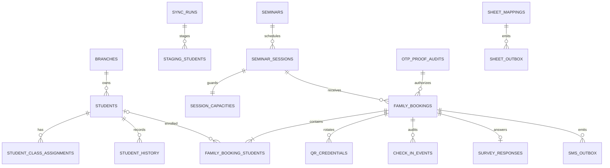

# Backend ERD and invariants

Public identifiers are UUIDs; internal joins use `bigint` identities. All
operational timestamps are `timestamptz`.

## Students and contacts

`students` and `staging_students` preserve independently encrypted mother and
father phone values with keyed digest and last-four columns. Current canonical
snapshot files omit `fatherPhone`, so the initial father values are null; future
capture files may include the optional field without a schema change.

Public student ownership searches match the verified contact digest against
mother **or** father and return each student once. The source parser includes
both digests in its row hash and consistency checks.

## Family bookings and participants

`family_bookings` stores one generic verified `contact_*` value. A partial
unique index permits only one `RESERVED` or `CHECKED_IN` booking for a contact
and session.

`family_booking_students` is a participant table:

- `ENROLLED` requires a real `student_id`.
- `GUEST` requires `student_id IS NULL`, uses the link UUID as its public
  participant ID, and receives an internal `비재원-000001` number from a
  non-transactional PostgreSQL sequence.
- Both types retain immutable booking-time display, branch, school, grade,
  unit, and teacher snapshots.

The active enrolled index is unique on `(session_id, student_id)` where the
student ID is not null. Capacity and duplicate decisions are made while the
relevant capacity rows are locked.

Session moves lock source and target capacity rows in numeric order. The
composite participant/booking FK is `DEFERRABLE INITIALLY IMMEDIATE`; the move
transaction explicitly defers it, updates the booking and every participant,
then validates it at commit. QR credentials are unchanged during a move.

## Proofs, QR, and external delivery

OTP and booking proofs are stored only as digests. Mutation proofs are consumed
in the same transaction as create, update, cancel, QR rotation, or survey
submission. Raw QR values are returned on fresh issuance only; replay snapshots
are secret-free.

SMS and Google Sheets writes use durable outboxes. Sheet rows carry encrypted
event snapshots and stable UUID markers; raw QR bearer tokens are forbidden.

## Append-only relations

Database triggers reject updates and deletes on authentication audits, student
history, pairing audits, booking/check-in events, SMS/Sheet attempts, and survey
responses. Runtime roles have no delete grants on domain or audit ledgers.
