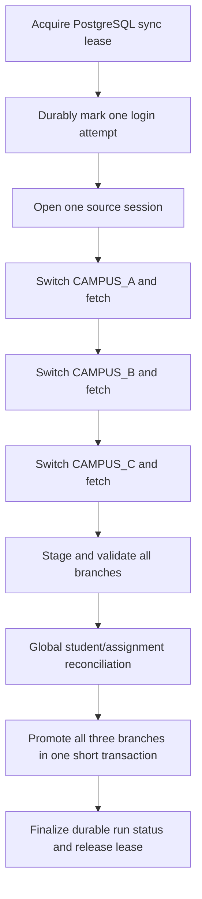

# TongTongTong student sync runbook

## Source contract

The fixed domain contract is:

- campus order: `CAMPUS_A`, then `CAMPUS_B`, then `CAMPUS_C`;
- one authenticated account/session for the whole run;
- active filter: `selbs_inorout=NN`;
- no `seltd_schlevel` parameter, so all grades are fetched;
- each branch payload's `colModel.title -> dataIndx` mapping is authoritative;
- fixed positional keys such as `m1`/`m2` are not used.

The father-contact column title is optional. If it is absent from a branch
`colModel`, promotion preserves the existing encrypted father contact. If the
column is present and its row value is explicitly empty, promotion clears that
contact; a non-empty value replaces it. This observed/unobserved distinction is
stored in staging and covered by the staging integrity boundary.

Login, campus-switch, context markers, grid paths, and exact column titles are
deliberately not guessed. The HTTP adapter makes no request unless
`TONG_SYNC_ENABLED=true`, `TONG_WIRE_CONTRACT_CONFIRMED=true`, an HTTPS-only
origin, credentials, and the strict wire-contract JSON are all present. It
keeps cookies in memory and never logs request/response bodies, credentials,
cookies, query strings, or contacts.
All adapter requests use the same stable `NPR-Student-Sync/1.0` user agent as
the separately verified one-shot login and snapshot capture tooling.
Response bytes are decoded from the declared Content-Type charset. UTF-8 and
the legacy EUC-KR/CP949 aliases are supported; invalid, undeclared non-UTF-8,
or unsupported encodings fail closed before marker or JSON evaluation.

The default gateway makes no remote request and returns `TONG_SYNC_DISABLED`.
An enabled but unconfirmed adapter also makes no request and returns
`TONG_WIRE_CONTRACT_UNCONFIRMED` without opening the authentication circuit.

## Six-hour/manual flow



The scheduler runs at six-hour boundaries in `Asia/Seoul`. Manual and scheduled executions use the identical orchestrator. The lease blocks overlap across replicas.

`GET /api/v1/admin/student-sync/status` reports `liveSourceReady=true` only
when the current API process has both the explicit live-sync enablement and the
confirmed local wire configuration. Computing readiness is local and sends no
upstream request. A run is startable only when this readiness is true, the
durable circuit is `CLOSED`, and no other run owns the lease.

Manual `POST /runs/manual` durably claims the run and lease, returns HTTP 202,
and starts execution in the background. Poll `GET /runs/{runId}` and/or the
append-only `/events?runId=...` cursor until the run reaches a terminal state.

Login, campus switching, and fetch happen outside database transactions. All
three branches must finish before one staging/validation phase and one atomic
promotion transaction. No partial branch publication is allowed.

## Validation and promotion safety

A branch is not promotable when any of the following occurs:

- login, campus switching/context verification, fetch, normalization, or staging fails;
- its active normalized snapshot is empty;
- a `(studentNo, sourceAssignmentKey)` is duplicated within a branch;
- one globally unique student number is present in more than one branch;
- identity fields disagree across assignments for one student;
- row counts drift sharply from the latest successful branch snapshot.

Only a run with all three branch rows at `VALIDATED` enters promotion. Promotion
locks the run, verifies the persisted staging hash, processes students and
assignments, and only then soft-inactivates rows absent from the complete
validated snapshot. A `FAILED`, `CANCELLED`, or `CONFLICT` run never reaches
the inactivation queries.

Only `재원생` rows are included. A class name is accepted when it is
bracketless without `*`, or when its only bracket pair is one terminal
timetable suffix: one to three distinct weekday characters with an optional
positive slot 1..99 without a leading zero, or `E`/`e` with that slot.
Repeated weekdays, zero/leading-zero slots, other Latin prefixes, asterisks,
management suffixes, and every other bracket form are staged as excluded.
Accepted source class names and source keys are preserved verbatim; unit,
science, supplementary, representative, and same-base de-duplication logic
uses the suffix-stripped base. Supplementary names containing `특강`, `패키지`,
`입시대비`, or `TEST`, plus subject-only `기하[시간]`, remain assignment
history but are excluded from representative-class candidates. A sole regular
class (for example `3T3A`) wins over science;
science includes the `과` prefix and explicit 물리/화학/생명과학/생물/지구과학
tokens and displays as `과학`. Ambiguous records are loaded with a quality flag.

Running the same snapshot again updates only last-seen run metadata. It appends no duplicate student history and reports `NO_CHANGES`.

The schedule-suffix constraint migration is a no-gap replacement: in one
explicit transaction it adds and validates a temporary relaxed constraint
while the prior strict constraint remains active, then drops the prior
constraint and renames the validated replacement. It uses transaction-local
5-second lock and 120-second statement timeouts. Any timeout or validation
error rolls the transaction back, leaving the prior constraint intact.

## Failure, circuit, and rollback

- A failed or indeterminate login, switch, context check, or fetch immediately
  opens the durable circuit, marks the run failed, cancels later branches, and
  permits no publication from that run.
- There is exactly one logical login attempt and zero automatic login retries.
- If a process dies after the durable login-attempt marker, lease recovery treats
  the prior result as indeterminate, opens the circuit, and never relogs.
- A promotion exception rolls back the complete three-branch transaction and
  marks the run failed in a new short transaction.
- No branch promotion transaction spans a source call.
- The UI continues reading the last committed PostgreSQL state throughout a run.
- Redis loss has no effect on student sync correctness.

Do not manually change a failed branch to `VALIDATED`, reset the circuit
automatically, or use reset as a login test. An ADMIN must independently verify
upstream recovery, enter the exact confirmation text and reason, then use the
CSRF-protected reset endpoint. Reset itself makes no upstream request.

## Initial load

The initial-snapshot dry-run endpoint intentionally rejects a non-empty student
database with HTTP 409. Never run it against the populated production database
as a reconciliation shortcut. Rehearse or revalidate an immutable snapshot
only on a disposable fresh database or an access-controlled restore clone, and
destroy that environment after retaining only safe aggregate evidence.

1. Call `POST /api/v1/admin/student-sync/initial-snapshot/dry-runs`.
2. Confirm all three branch states are `READY_TO_PUBLISH`, counts are plausible, exclusions are expected, and the global run is `READY_TO_PUBLISH` with `publishable=true`.
3. Publish that exact run with `POST /api/v1/admin/student-sync/initial-snapshot/dry-runs/{runId}/publish`.

Publication locks the dry run and all branch rows in required order, then promotes all three snapshots in one transaction. Any constraint or promotion failure rolls back all three. A run that is incomplete, conflicted, already published, or no longer publishable is rejected.

## State machines

Incremental run:

```text
RUNNING -> PUBLISHING -> SUCCEEDED | NO_CHANGES
        \-> FAILED | CONFLICT
```

Initial run:

```text
RUNNING -> READY_TO_PUBLISH -> PUBLISHING -> PUBLISHED
        \-> FAILED
```

Branch run:

```text
PENDING -> FETCHING -> STAGED -> VALIDATED -> PROMOTING -> PROMOTED | NO_CHANGES
       \-> CANCELLED | FAILED       \-> CONFLICT
```

Initial dry-run branches use `READY_TO_PUBLISH` in place of `VALIDATED` until the single publication transaction begins.

## Operational checks

- Use the admin status/run endpoints; PostgreSQL status is authoritative.
- Investigate `errorCode` and `sync_conflicts`, not raw source payloads.
- Alert on `FAILED`, `CONFLICT`, an open authentication circuit, a stale latest successful run, unexpected count deltas, and a lease older than its configured duration.
- To recover an abandoned lease, first prove no application instance or source session is active. Update only the named lease row through an approved database change procedure; never alter student/event/history rows.
- Rotate source credentials and cryptographic keys through the secret manager. Key rotation requires a planned contact-digest migration because lookup digests are key-dependent.
