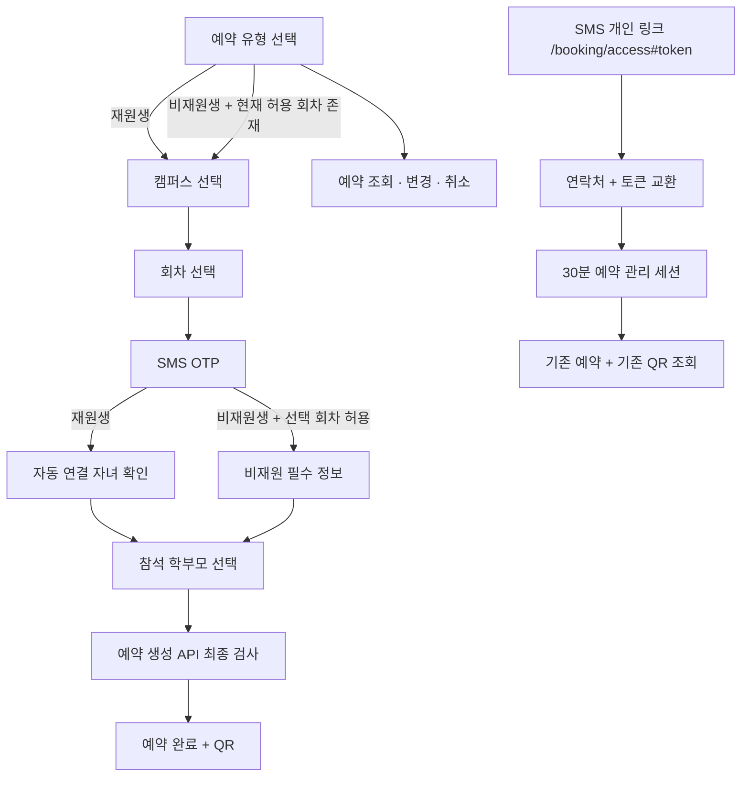

# 예약 플로우 최종 프론트엔드 구현 맵

> 상태: **설계·구현 준비 완료 / 제품 코드 미수정**  
> 소유 범위: `apps/web`  
> 구현 담당: Claude Code `opus` 일반 모드  
> 새 첫 화면 디자인: Fable `/design` → Product Design `ideate` 3안 → **사용자 선택 후** Opus 구현

## 0. 구현 시작 전 하드 스톱

이 문서는 구현 맵과 Opus 작업 프롬프트만 정의한다. 다음 두 조건이 모두 충족되기 전에는 `apps/web`을 수정하지 않는다.

1. [`reservation-type-entry-fable-handoff.md`](./reservation-type-entry-fable-handoff.md)를 바탕으로 Product Design `ideate`가 정확히 3개의 시각안을 만들고 사용자가 1개를 선택한다.
2. 아래 `비재원생 진입 정책`의 안전한 해석을 사용자에게 명시하고 확인받는다.

### 구현 전에 사용자에게 그대로 보여 줄 정책 문구

> 비재원생 예약 첫 진입은 **현재 공개 회차 중 `guestBookingEnabled=true`인 회차가 하나라도 있을 때만** 활성화하겠습니다. 진입 가능 표시는 안내일 뿐이고, 실제로는 캠퍼스·회차 선택 시 해당 회차의 플래그를 다시 확인하며 예약 생성 API가 마지막으로 다시 차단합니다. 목록을 불러오는 중이거나 실패한 경우에는 비재원생 진입을 열지 않습니다.

이 해석의 의도는 오래된 클라이언트 상태나 회차별 설정 차이로 비재원 예약이 잘못 열리는 것을 막는 것이다.

### 기존 Fable 핸드오프와 달라진 점

기존 핸드오프는 비재원생 카드를 날짜(`7/23일부터 예약 가능`)로 고정 비활성화하고 데이터 상태가 없다고 가정한다. 최종 계약은 회차별 `guestBookingEnabled`가 권위이므로 구현 시 다음처럼 교체한다.

- 첫 화면은 `usePublicSessions()`의 로딩·오류·회차 플래그에 의존한다.
- 로딩 중: 카드 비활성, `예약 가능 여부 확인 중`.
- 목록 오류: 카드 비활성, 목록 재시도 동선 공유. 실패 상태에서 임의로 활성화하지 않는다.
- 활성 가능한 회차가 없음: 카드 비활성. 고정 날짜 문구는 운영 정책이 별도로 확정된 경우에만 보조문으로 사용한다.
- 활성 가능한 회차가 하나 이상: 카드 활성. 선택 후에도 캠퍼스·회차 및 생성 API에서 재검사한다.

따라서 Fable 3안은 **레이아웃·위계·시각 언어의 기준**이고, 활성 상태와 카피는 위 동적 정책을 적용해 다시 렌더해야 한다.

## 1. 현재 코드와 계약의 차이

| 영역 | 현재 프론트 | 권위 계약/목표 | 결과 |
| --- | --- | --- | --- |
| 첫 진입 | `ReserveFlow`가 `campus`에서 시작 | 예약 유형 선택이 첫 화면 | 새 화면 선택 전 구현 금지 |
| 비재원 허용 | 재원생 선택 화면에서 항상 `비재원생 예약하기` 노출 | 회차별 `guestBookingEnabled` | 첫 화면·회차·생성 3중 검사 |
| OTP 캠퍼스 | `branch`가 선택적 폴백으로 주석화 | `FAMILY_BOOKING`이면 `branch` 필수, proof에 귀속 | 로컬 계약을 판별 유니언으로 수정 |
| 재원생 | 자녀를 수동 다중 선택하고 `studentIds` 전송 | 선택 캠퍼스에서 연락처가 맞는 활성 학생 전원을 서버가 자동 연결; 생성 본문에 `studentIds` 없음 | 조회 결과는 읽기 전용 자동 포함 표시 |
| 비재원 필드 | 이름만 필수, 학교·학년 선택 텍스트 | 이름·캠퍼스·학교·학년 모두 필수, 학년 enum | 학교 required, 학년 Select |
| 개인 링크 | `/booking/{familyBookingId}` + BOOKING_MANAGE OTP | SMS의 `/booking/access#token=...`를 연락처와 교환해 30분 관리 세션 생성 | 새 라우트·교환 어댑터·세션 모드 필요 |
| QR 관리 | 재발급 후에만 QR을 표시 | 관리 세션/legacy proof로 기존 QR 복구 GET 지원; 회전 API는 deprecated | 기존 QR 복구로 전환 |
| 관리자 비재원 설정 | 화면/어댑터 없음 | `PATCH /admin/seminar-sessions/{id}`의 `guestBookingEnabled` | 선택 회차 헤더에 Switch |
| 스캐너 문구 | `입장 완료` + `입장 처리됐어요.` + 별도 `N명 입장` | 대표학생·참석 학부모·인원을 한 문장으로 확인 | 계약 필드 동기화 후 동적 카피 |
| 잔여석 | 공개 회차와 변경 후보에 숫자 노출 | 공개 부모 UI에서는 숨김, 서버 판정 로직은 유지 | 두 렌더 지점만 제거 |
| 뒤로가기 | `pick → auth`에서 proof/challenge/자녀 상태 유지 | 인증 이후 뒤로가기는 인증·하위 상태 무효화 | 중앙 전환 헬퍼 필요 |

권위 순서는 `packages/contracts/openapi.yaml` → `apps/web/src/shared/api/contract.ts` → 화면이다. `docs/specs`의 옛 다중 선택/선택 필드 설명은 이 작업에서 권위가 아니다.

## 2. 목표 상태 머신



### 상태와 전환 규칙

| 상태 | 진입 조건 | 뒤로가기 | 보안/데이터 규칙 |
| --- | --- | --- | --- |
| `type` | 앱 최초/초기화 | 없음 | 비재원 활성 여부는 공개 회차 집합으로 계산 |
| `campus` | 참가 유형 선택 | `type` | 유형 변경 시 session/proof/OTP/자녀/guest 초안 제거 |
| `list` | 캠퍼스 선택 | `campus` | GUEST면 `guestBookingEnabled=true` 회차만 선택 가능 |
| `auth` | 회차 선택 | `list` | `FAMILY_BOOKING` OTP에 branch 필수 |
| `children` | ENROLLED OTP 성공 | `auth` | 모든 하위 인증 상태 무효화 후 돌아감; 자녀는 자동 포함·읽기 전용 |
| `guest` | GUEST OTP 성공 + 선택 회차 허용 | `auth` | 이름·학교·학년 모두 필수 |
| `done` | 생성 성공 | `type` | proof 소비, QR 원문은 메모리만 사용 |
| `manage` | 첫 화면 링크 | `type` | 기존 BOOKING_MANAGE OTP 호환 경로 |

`children/guest → auth` 전환은 다음을 한 함수에서 처리한다.

- `proof.clear()`
- `otp.restart()`로 challenge id·코드·단계·멱등 키 제거
- 자녀·자녀 오류·guest 초안·생성 오류·생성 멱등 키 제거
- 인증된 것으로 판단하는 상태를 하나도 남기지 않음
- 연락처 숫자는 입력 편의를 위해 남길 수 있으나 **인증 효력은 전혀 없음**을 코드와 테스트로 고정

캠퍼스나 회차가 바뀌는 전환도 같은 하위 상태 무효화 함수를 사용한다. 화면별로 일부 상태만 수동 초기화하지 않는다.

## 3. 파일·컴포넌트별 구현 맵

### 3.1 계약과 API 어댑터

#### `apps/web/src/shared/api/contract.ts`

- `PublicSeminarSession`과 `AdminSeminarSession`에 필수 `guestBookingEnabled: boolean` 추가.
- `OtpChallengeRequest`를 아래 의미의 판별 유니언으로 변경.
  - `FAMILY_BOOKING`: `branch` 필수.
  - `BOOKING_MANAGE`: `branch`를 보내지 않음.
- `GuestGrade`를 `초1`…`초6`, `중1`…`중3`, `고1`…`고3`의 정확한 유니언으로 선언.
- `PublicGuestParticipantInput.schoolName`과 `grade`를 필수로 변경.
- `PublicFamilyBookingCreateRequest`의 ENROLLED 가지에서 `studentIds` 삭제.
- `BookingAccessExchangeRequest`, `BookingAccessExchangeResult`, `QrRecoveryResult` 추가.
- `CheckInRepresentativeStudent` 추가 후 `CheckInOutcome`에 다음 필드 동기화.
  - `attendanceParty: AttendanceParty | null`
  - `representativeStudentName: string | null`
  - `representativeStudent: CheckInRepresentativeStudent | null`
- 계약 주석에서 “QR 원문은 복구 불가”처럼 더 이상 맞지 않는 설명을 제거하고, AEAD 복구 GET과 fragment access token 경계를 정확히 반영.

#### `apps/web/src/shared/api/public-booking.ts`

- `exchangeBookingAccessToken(body, idempotencyKey)` 추가.
  - POST `/public/booking-access/session`.
  - 성공 응답의 새 `csrfToken`을 `adoptCsrfToken`으로 즉시 교체. 교환 전에 부트스트랩한 CSRF를 재생성된 세션에서 재사용하지 않는다.
- `recoverOwnedFamilyBookingQr(familyBookingId, auth)` 추가.
  - GET `/public/family-bookings/{id}/qr`.
  - proof 또는 booking-management cookie session 중 정확히 한 인증 모드를 사용.
- 예약 GET/PATCH/cancel 어댑터가 legacy proof와 관리 세션을 타입으로 구분하도록 정리.
  - 관리 세션 호출은 `bookingProof` 헤더를 붙이지 않는다.
  - durable 변경은 기존 `Idempotency-Key`와 CSRF 규칙을 유지한다.
- deprecated `rotateOwnedFamilyBookingQr`는 신규 개인 링크 경로에서 사용하지 않는다. 호환 기간 동안 남기더라도 새 UI의 기본 동작으로 연결하지 않는다.
- 오류는 status만 보지 않고 `ApiError.code`로 분기할 수 있게 화면에서 원문 코드를 보존한다.

#### `apps/web/src/shared/api/admin-seminars.ts`

- `SeminarSessionUpdateRequest`의 프론트 타입을 추가하고 `updateAdminSeminarSession` 구현.
- PATCH `/admin/seminar-sessions/{sessionId}`에 `{ guestBookingEnabled, expectedVersion }` 전송.
- 호출부가 제공한 멱등 키를 그대로 사용. 응답은 `normalizeAdminSeminarSession`을 통과시킨다.

### 3.2 예약 유형·캠퍼스·회차·OTP·자동 자녀

#### 새 파일 `apps/web/src/widgets/reserve-flow/ui/ReservationTypeStep.tsx`

- 사용자 선택을 마친 시각안만 `image-to-code` 기준으로 구현.
- props는 데이터와 동작만 받도록 유지: `guestState`, `onSelectEnrolled`, `onSelectGuest`, `onManage`, `onRetry`.
- `guestState`는 `loading | error | disabled | enabled`로 명시해 boolean 하나로 오류를 숨기지 않는다.
- 활성/비활성 카드 모두 의미가 읽히게 하고, 비활성 카드는 클릭·키보드 진입을 막는다.
- Fable가 정한 360/390/480px 규칙과 기존 `FlowHeader`·카드 토큰을 그대로 사용한다.

#### `apps/web/src/widgets/reserve-flow/ui/ReserveFlow.tsx`

- `Step`을 `type | campus | list | auth | children | guest | done | manage`로 변경하고 초기값은 `type`.
- `participantType: ENROLLED | GUEST | null` 상태 추가.
- `guestEntryEnabled = sessions.some(session => session.guestBookingEnabled)`를 **성공적으로 불러온 현재 공개 목록**에서만 계산.
- GUEST 캠퍼스 카드 수와 회차 목록은 캠퍼스 가시성 + `guestBookingEnabled=true`를 동시에 만족하는 회차만 센다.
- 회차 클릭 직전 선택된 항목의 flag를 다시 확인하고, GUEST인데 false면 진입하지 않는다.
- `useOtpFlow`에 선택 캠퍼스를 필수로 제공. participant type은 proof가 아니라 화면 흐름에만 둔다.
- OTP 성공 분기:
  - ENROLLED: `searchAuthorizedStudents({ branch, pageSize: 100 })` 호출 후 `children`.
  - GUEST: 선택 회차 flag를 다시 확인 후 `guest`.
- ENROLLED 자녀 화면:
  - 반환된 활성 자녀를 모두 자동 포함된 읽기 전용 카드로 표시.
  - 체크박스·`pickedIds`·다중 선택 안내 제거.
  - 자녀 수에 따라 `N명 자동 연결됨`, 생성 CTA는 `N명 예약하기`.
  - 0명은 `ENROLLED_STUDENT_NOT_FOUND`와 동일한 의미로 안내하고 유형 선택부터 다시 시작하는 CTA 제공. guest로 몰래 전환하지 않는다.
- ENROLLED 생성 본문은 `participantType`, `seminarSessionId`, `attendanceParty`만 전송.
- GUEST 폼:
  - 학생 이름 required Input.
  - 학교 required Input.
  - 학년 required Select; 정확한 `GuestGrade` 옵션만 허용.
  - 캠퍼스는 선택값을 읽기 전용으로 표시하고 본문에 포함.
  - 세 필드가 모두 유효해야 CTA 활성.
- 생성 전 GUEST 선택 회차 flag를 다시 확인. 실제 권위는 POST 응답.
- 기존 재원생 화면의 상시 `비재원생 예약하기` 폴백 제거. 흐름 변경은 첫 화면에서만 한다.
- 공개 회차 카드의 `잔여 N석` 배지를 제거. `availability`로 disabled/마감 상태를 제어하는 로직은 유지.
- 한 중앙 함수로 인증·하위 상태 무효화. `children`·`guest`의 back, 캠퍼스/회차 변경, 유형 변경이 모두 이를 사용.

#### 생성 오류별 UX

| API code | 사용자 동작 |
| --- | --- |
| `GUEST_BOOKING_DISABLED` | `이 회차의 비재원생 예약이 마감됐어요` 안내 후 회차 목록으로 복귀, 목록 reload |
| `ENROLLED_CONTACT_MUST_USE_ENROLLED_FLOW` | 재원생 연락처임을 안내하고 `재원생 예약으로 다시 시작` CTA; proof/OTP 초기화 |
| `ENROLLED_STUDENT_NOT_FOUND` | 선택 캠퍼스에 연결된 재원생이 없음을 안내하고 유형 선택으로 복귀 |
| `ACTIVE_FAMILY_BOOKING_EXISTS` | `이미 같은 연락처로 예약이 있어요` + 예약 조회 CTA |
| `SESSION_BRANCH_MISMATCH` | 캠퍼스/회차 재선택 안내 |
| `CAPACITY_EXCEEDED`, `SESSION_NOT_BOOKABLE`, `BOOKING_WINDOW_CLOSED` | 회차 목록 reload 후 해당 회차 마감 상태 반영 |
| proof 만료 계열 | proof/OTP 초기화 후 인증 화면 |

status 409 하나를 모두 “이미 예약”으로 번역하지 않는다.

### 3.3 SMS 개인 링크와 예약 관리

#### 새 파일 `apps/web/src/app/booking/access/page.tsx`

- metadata `robots: { index: false, follow: false }`.
- 서버에서 fragment를 읽지 않는다. 클라이언트 `BookingAccessView`만 렌더.

#### 새 파일 `apps/web/src/views/booking-access/ui/BookingAccessView.tsx`

- 첫 mount에서 `#token=<43자 base64url>`만 엄격히 파싱.
- 토큰을 메모리에 옮긴 직후 `history.replaceState`로 fragment를 주소창과 history에서 제거한 뒤 연락처 입력을 보여 준다.
- 토큰을 path/query/storage/log/오류문구/분석 이벤트에 넣지 않는다.
- 예약 연락처 전체 번호와 token을 `exchangeBookingAccessToken`으로 교환.
- 성공 후 raw token 상태를 즉시 비우고, 반환된 `familyBookingId`만 관리 패널에 전달.
- 401은 token과 연락처 중 무엇이 틀렸는지 구분하지 않는 문구, 429는 재시도 대기, fragment 없음/형식 오류는 `문자에서 링크를 다시 열어주세요`로 처리.
- 예약 상세나 학생 이름은 교환 성공 전 절대 요청·표시하지 않는다.

#### 새 파일 `apps/web/src/entities/reservation/lib/booking-access-fragment.ts`

- fragment 파싱을 순수 함수로 분리해 DOM 없이 테스트.
- 허용하지 않는 길이·문자·중복 token·query/path token을 거절.
- 반환값을 문자열화하거나 로그하지 않는다.

#### `apps/web/src/widgets/reserve-flow/ui/ManageBookingPanel.tsx`

- 인증 모드를 명시적으로 분리.
  - `legacyProof`: 루트 예약 조회와 `/booking/{familyBookingId}` OTP 호환.
  - `accessSession`: `/booking/access` 교환 성공 후 30분 cookie session.
- accessSession은 OTP 화면 없이 대상 예약 하나만 GET하고, 이어서 현재 QR을 GET으로 복구.
- legacyProof도 인증 성공 직후 QR recovery GET을 사용해 기존 QR을 표시. “다시 불러올 수 없다”는 옛 안내 제거.
- QR 회전은 기본 관리 UX에서 제거하고 현재 QR 복구를 사용. QR 원문은 컴포넌트 메모리에서만 유지.
- accessSession 변경·취소 성공은 세션이 유지되므로 proof 소비 안내를 띄우지 않는다. legacy proof 변경만 기존 재인증 규칙을 유지.
- 세션 만료 401/403은 `문자의 예약 링크를 다시 열어주세요`로 처리하고 예약 데이터를 더 이상 표시하지 않는다.
- 회차 변경 후보의 `· 잔여 N석` 텍스트를 제거. 가능 여부 필터는 유지.
- 예약 상세/QR 조회 중 로딩, QR revoked/expired(409/410), 관리 세션 만료를 서로 다른 상태로 표시.

#### 기존 호환 파일

- `apps/web/src/views/booking-detail/ui/BookingDetailView.tsx`와 `/booking/[familyBookingId]`는 1회 호환 기간 동안 ID + OTP 흐름으로 유지할 수 있다.
- `apps/web/src/entities/reservation/lib/booking-management-url.ts`의 ID 링크는 **OTP가 필요한 안전한 호환 링크**다.
- 현재 생성 응답에는 booking access raw token이 없으므로 완료 화면의 `URL 복사` 버튼을 개인 access link로 바꿀 수 없다. 프론트가 토큰을 만들거나 추측하면 안 된다.
- 개인 access link는 백엔드 SMS outbox가 만든 `/booking/access#token=...`만 권위가 있다. 완료 화면 복사 버튼은 ID+OTP 링크임을 주석과 접근명에서 명확히 하거나, 별도 계약 없이 개인 링크라고 부르지 않는다.
- `ReservationQr.tsx` 주석은 “토큰 URL이 존재하지 않는다”가 아니라 “QR token은 URL 금지, booking access token만 fragment 허용”으로 수정.

### 3.4 관리자 회차별 비재원생 토글

#### 새 파일 권장 `apps/web/src/features/admin-overview/model/useGuestBookingToggle.ts`

- `useOperationKey`로 선택 회차 1회 조작의 키를 보존.
- 서버 응답 전에는 값을 성공한 것처럼 확정하지 않는 pessimistic mutation.
- 성공: 선택 회차 응답 반영 또는 `sessions.reload()`.
- 409 version conflict: 목록 reload 후 `다른 관리자 변경을 반영했어요. 다시 확인해 주세요.`
- network/5xx: 결과 미상 키를 유지하고 재시도 전 GET/reload로 reconciliation.

#### `apps/web/src/views/sessions/ui/SessionsView.tsx`

- 선택 회차 상단 카드의 제목/상태/시간 메타와 같은 정보 군에 기존 `Switch` 추가.
- 레이블: `비재원생 예약 허용`.
- 저장 중 disabled + `저장 중`, 성공은 `허용됨/허용 안 함` status로 짧게 알림.
- 이 토글은 API가 존재하므로 활성이다. POC 복원 때문에 비활성인 `새 설명회`, `종료`, `삭제`와 섞어 `API 연결 전`로 처리하지 않는다.
- 선택 회차 변경 시 이전 회차의 결과 미상 조작을 다른 회차에 재사용하지 않는다.
- POC의 전체 레이아웃·카드 크기·통계 배치를 재설계하지 않는다.

### 3.5 스캐너 성공 문구

#### `apps/web/src/features/scanner-session/ui/CheckInResultPanel.tsx`

`presentResult(result)`를 `presentOutcome(outcome)`로 바꾸거나 별도 순수 formatter를 둔다. `CheckInOutcome`의 서버 필드를 사용하며 학생/학부모 종류를 추정하지 않는다.

- `CHECKED_IN` 정확한 문구:
  - `{대표학생명} 학생 학부모({모|부|모/부}) {1|2}명 입장 완료`
- `ALREADY_CHECKED_IN`:
  - 같은 `representativeStudentName`을 유지하고 `{대표학생명} 학생 학부모({모|부|모/부}) 이미 입장 완료` 표시.
  - 별도의 `N명 입장` 줄을 다시 그려 새 입장처럼 보이게 하지 않는다.
- `ATTENDANCE_PARTY_LABELS`와 `familySeatCount`만 사용.
- success/already 결과에서 필수 문맥이 null이면 `undefined`를 노출하지 않고 안전한 일반 문구로 폴백하되, 계약 회귀 테스트에서는 두 결과가 항상 문맥을 주는지 검증.
- 관리자 페어링 성공 카피(`usePairingCode`)는 이번 범위가 아니므로 수정하지 않는다.

### 3.6 잔여석 숨김

숫자 노출만 제거하고 서버의 정원 판정·`availability`·회차 변경 가능 필터는 유지한다.

1. `ReserveFlow.tsx`: 공개 회차 카드의 `잔여 {remainingCapacity}석` 제거.
2. `ManageBookingPanel.tsx`: 회차 변경 후보의 `· 잔여 {remainingCapacity}석` 제거.

관리자 운영 화면의 정원/집계는 별도 요구사항이므로 건드리지 않는다.

## 4. API 호출 맵

| 사용자 행동 | 메서드·경로 | 프론트 본문/헤더 | 성공 후 |
| --- | --- | --- | --- |
| 첫 화면 가능 여부 | GET `/api/v1/public/seminar-sessions` | 인증 없음 | `some(guestBookingEnabled)` 계산 |
| OTP 요청 | POST `/api/v1/public/otp/challenges` | `{contact, purpose:FAMILY_BOOKING, branch}` + CSRF + Idempotency | challenge만 메모리 보관 |
| OTP 확인 | POST `/api/v1/public/otp/challenges/{id}/verify` | `{oneTimeCode}` + CSRF + Idempotency | proof 메모리 보관 |
| 자동 자녀 표시 | GET `/api/v1/public/students?branch=...` | `X-Booking-Proof` | 전체 자녀 읽기 전용 표시 |
| 재원 예약 | POST `/api/v1/public/family-bookings` | ENROLLED, **studentIds 없음** + proof + Idempotency | proof 소비, QR 표시 |
| 비재원 예약 | POST `/api/v1/public/family-bookings` | GUEST + name/branch/schoolName/grade + proof + Idempotency | 서버 flag 최종 검사 |
| 개인 링크 교환 | POST `/api/v1/public/booking-access/session` | fragment token + full contact body, CSRF + Idempotency | 새 CSRF 채택, 30분 cookie session |
| 개인 예약 조회 | GET `/api/v1/public/family-bookings/{id}` | cookie, proof 헤더 없음 | 상세 표시 |
| 기존 QR 복구 | GET `/api/v1/public/family-bookings/{id}/qr` | cookie 또는 legacy proof | QR 메모리 표시 |
| 개인 변경/취소 | PATCH/POST 기존 public 관리 API | cookie + CSRF + Idempotency | accessSession 유지 |
| 관리자 guest 토글 | PATCH `/api/v1/admin/seminar-sessions/{id}` | `{guestBookingEnabled, expectedVersion}` + cookie/CSRF/Idempotency | 회차 reload/응답 반영 |

## 5. 테스트 구현 맵

### 순수/어댑터 대상 테스트

- `apps/web/src/shared/api/public-booking.test.ts` 신규
  - ENROLLED 생성 본문에 `studentIds`가 없음.
  - GUEST 필수 4필드 전송.
  - booking access 교환이 body에만 token을 싣고 URL/query/header에 싣지 않음.
  - 교환 응답 CSRF 채택.
  - 관리 세션 GET은 proof 헤더가 없음.
- `apps/web/src/shared/api/admin-seminars.test.ts` 확장
  - guest toggle PATCH path/body/expectedVersion/idempotency.
  - 응답 `guestBookingEnabled` 보존.
- `apps/web/src/entities/reservation/lib/booking-access-fragment.test.ts` 신규
  - 정상, 누락, 중복, 잘못된 문자/길이.
  - parser가 token을 path/query로 만들지 않음.
- `apps/web/src/entities/reservation/lib/booking-management-url.test.ts` 유지/문구 갱신
  - ID+OTP 호환 링크에는 QR/access token이 없음.
- 스캐너 formatter 순수 테스트 신규
  - 모 1명, 부 1명, 모/부 2명.
  - CHECKED_IN 정확 문구.
  - ALREADY_CHECKED_IN 대표학생명 유지 + `이미 입장 완료`.
  - null 방어.
- 예약 흐름 reducer/정책을 순수 함수로 추출해 테스트 권장
  - 첫 목록 0/일부/전체 guest enabled.
  - 캠퍼스별 GUEST 회차 필터.
  - back 시 proof/challenge/children/guest/create key 무효화.
  - ENROLLED 자동 전원 포함, 0명 처리.

### 브라우저·시각 QA

- 선택된 첫 화면 시각안과 360×800, 390×844, 480×900에서 나란히 비교.
- 로딩·오류·guest disabled·guest enabled 네 상태 캡처.
- 캠퍼스 → 회차 → OTP → 자동 자녀/guest → 완료 전 흐름을 키보드와 터치로 확인.
- children/guest에서 back 후 이전 proof로 생성 요청이 나가지 않는지 네트워크에서 확인.
- 공개 회차/회차 변경 목록에 `잔여`, `remainingCapacity` 숫자가 보이지 않는지 확인.
- `/booking/access#token=...` 진입 직후 주소창에서 fragment가 제거되고, 교환 전 예약 데이터 요청이 없는지 확인.
- 개인 링크로 기존 QR 조회·변경·취소 후 세션 모드가 proof 재인증 안내를 잘못 띄우지 않는지 확인.
- 관리자 토글의 저장 중, 성공, 409, network 결과 미상 상태 확인.
- 스캐너 성공/중복 카피를 실제 1석·2석 fixture로 확인.

대상 테스트만 먼저 실행한다. 전체 lint/typecheck/build/e2e 게이트는 통합 마지막에 오케스트레이터가 한 번만 실행한다.

## 6. Claude Code Opus 구현 프롬프트

아래 프롬프트는 **사용자가 시각안을 선택하고 비재원 진입 정책을 확인한 뒤에만** 실행한다. `{SELECTED_VISUAL}`에는 선택된 시각안 이미지/경로를 넣는다.

```text
You are implementing an existing Next.js frontend in /home/ken/develop/npr-seminar.
Use Claude Code Opus in normal mode. Do not use Fast mode. Do not redesign the existing product.

HARD STOP BEFORE EDITING:
1. Read AGENTS.md completely.
2. Read packages/contracts/openapi.yaml for the exact endpoints and schemas named below.
3. Read docs/design/reservation-flow-final-frontend-implementation-map.md completely.
4. Read docs/design/reservation-type-entry-fable-handoff.md.
5. Confirm that the user selected this visual reference: {SELECTED_VISUAL}.
6. Confirm that the user accepted this policy: guest entry is enabled iff at least one currently public session has guestBookingEnabled=true; selected session and create API re-check it.
If either confirmation is missing, stop without editing and report the blocker.

Scope:
- Modify apps/web only, plus a design-QA report under docs/design if needed.
- Do not modify apps/api.
- packages/contracts/openapi.yaml is authoritative. Do not import apps/api internals.
- Preserve existing design tokens, MobileChrome, public API client, idempotency rules, and POC layouts.

Implement in this order:

A. Contract/API boundary
- Add required guestBookingEnabled to PublicSeminarSession and AdminSeminarSession.
- Make FAMILY_BOOKING OTP branch required in the local discriminated contract.
- Make guest name/branch/schoolName/grade required; grade is exactly 초1..초6, 중1..중3, 고1..고3.
- Remove studentIds from the ENROLLED public create request.
- Add BookingAccessExchangeRequest/Result and QrRecoveryResult.
- Sync CheckInOutcome attendanceParty, representativeStudentName, and representativeStudent.
- Add booking access exchange, QR recovery, management-session authorization, and admin session guest toggle adapters.
- After booking access exchange, adopt the returned csrfToken immediately because the server regenerated the session.

B. Reservation flow
- Add the selected reservation-type screen before campus. Implement the selected visual faithfully; do not choose a new direction.
- Guest card state comes from the loaded public sessions: loading/error/disabled/enabled. Never enable on load failure.
- Flow is type -> campus -> session -> OTP -> read-only auto-linked children OR required guest form -> attendance -> create -> done.
- For GUEST, filter/select only sessions with guestBookingEnabled=true and re-check before create. The POST result remains authoritative.
- For ENROLLED, call /public/students with the selected branch, show every returned active child as automatically included, and send no studentIds.
- Remove the always-on guest fallback from the enrolled child screen.
- Guest school and grade are required; use a Select for the enum grade.
- Branch/campus is the selected read-only value.
- Handle API codes GUEST_BOOKING_DISABLED, ENROLLED_CONTACT_MUST_USE_ENROLLED_FLOW, ENROLLED_STUDENT_NOT_FOUND, ACTIVE_FAMILY_BOOKING_EXISTS, SESSION_BRANCH_MISMATCH, CAPACITY_EXCEEDED, SESSION_NOT_BOOKABLE, and BOOKING_WINDOW_CLOSED distinctly.
- Centralize navigation invalidation. Going back from children/guest must clear proof, OTP challenge/code, downstream student/guest/create state, and operation keys. Keeping only unauthenticated contact input text is acceptable.
- Remove remaining-seat numbers from the public session list and management move list; keep availability logic.

C. Personal booking access
- Add /booking/access as a noindex client route.
- Read only #token=<43 base64url chars>, move it to memory, immediately remove the fragment with history.replaceState, and never put it in path/query/storage/log/error/analytics.
- Ask for the full booking contact, exchange it for the 30-minute management session, clear the raw token after success, and pass only familyBookingId to management UI.
- Do not fetch or render booking data before exchange succeeds.
- Refactor ManageBookingPanel to support legacy proof mode and access-session mode.
- Recover the current QR with GET /public/family-bookings/{id}/qr instead of relying on deprecated rotation. Keep QR raw material in memory only.
- Access-session mutations do not consume a legacy proof; session expiry asks the user to reopen the SMS link.
- Keep /booking/{familyBookingId} + OTP as compatibility. Do not fabricate a personal access URL on the completion screen: the create response does not return its raw access token. Clarify that its existing copied ID URL is an OTP-protected compatibility link.

D. Admin guest toggle
- Add an active Switch labelled "비재원생 예약 허용" to the selected session header in SessionsView without changing the POC layout.
- PATCH only {guestBookingEnabled, expectedVersion}, preserve idempotency, use a pessimistic saving state, reload/reconcile on success or ambiguity, and handle 409 version conflicts.
- Do not enable unrelated read-only POC actions.

E. Scanner copy
- CHECKED_IN exact visible copy: `{대표학생명} 학생 학부모({모|부|모/부}) {1|2}명 입장 완료`.
- ALREADY_CHECKED_IN keeps the same representative student and says `{대표학생명} 학생 학부모({모|부|모/부}) 이미 입장 완료`.
- Use server attendanceParty, representativeStudentName, and familySeatCount. Do not infer.
- Do not change pairing success copy.

Verification:
- Add targeted pure/API tests described in docs/design/reservation-flow-final-frontend-implementation-map.md.
- Run targeted frontend tests only. Do not run the repository-wide final gate; the orchestrator runs it once after integration.
- Run visual design QA at the same viewport/state as the selected reference, including loading/error/disabled/enabled guest states.
- Report changed files, API contract alignment, targeted test results, visual comparison, and any blocker. Do not claim success for untested behavior.
```

## 7. 완료 판정

프론트 작업은 다음을 모두 만족해야 완료다.

- 사용자 선택 시각안과 첫 화면이 같은 상태·뷰포트에서 일치.
- 비재원 진입이 전역 hard-code 날짜가 아니라 공개 회차 flag 집합으로 결정되고, 최종 회차와 POST가 다시 검사.
- FAMILY_BOOKING OTP가 캠퍼스 없이 전송될 수 없음.
- 재원생 생성 요청에 `studentIds`가 전혀 없음.
- 비재원 학교/학년이 빈 값으로 전송될 수 없음.
- 개인 access token이 fragment 외 URL 표면·storage·로그에 남지 않으며 교환 전 예약 데이터가 노출되지 않음.
- 관리 화면에서 기존 QR이 회전 없이 복구됨.
- 관리자 토글이 optimistic concurrency와 idempotency를 지킴.
- 스캐너 성공/중복 문구가 대표학생·참석 학부모를 정확히 표시.
- 공개 부모 화면에서 잔여석 숫자가 보이지 않음.
- 인증 이후 back으로 이전 proof를 재사용할 수 없음.

