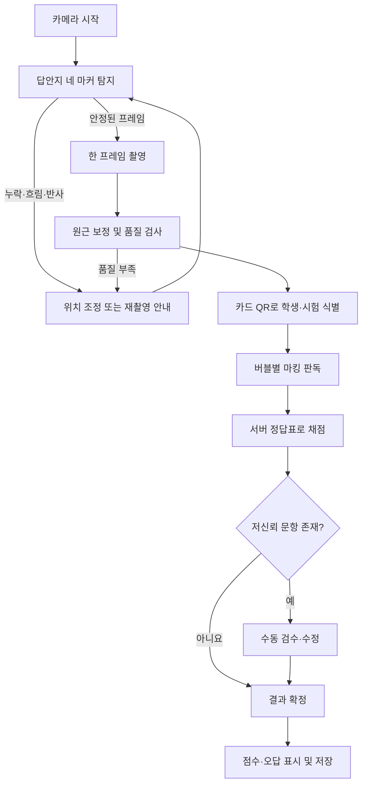

# OMR 카드 자동 채점기 타당성 및 선행 작업 계획

- 작성일: 2026-07-21
- 상태: 구현 전 타당성 검토
- 판정: 조건부 GO

## 1. 목표

고정된 OMR 카드를 카메라에 갖다 대면 다음 흐름을 자동으로 수행하는 별도 프로젝트를 만든다.

1. 답안지 전체와 정렬 기준점을 인식한다.
2. 안정된 프레임을 자동 또는 수동으로 촬영한다.
3. 학생과 시험을 식별한다.
4. 각 문항의 마킹을 판독한다.
5. 서버의 정답표로 채점한다.
6. 점수와 틀린 문항을 바로 보여준다.
7. 판독 결과, 최종 답안, 점수와 검수 이력을 저장한다.

목표 사용자 경험은 기존 QR 체크 흐름과 비슷하다.

```text
카드 갖다 대기
  → 용지 정렬 확인
  → 자동 촬영
  → OMR 판독 및 채점
  → 점수·오답·공란·복수 마킹 표시
  → 저장
```

## 2. 결론

다음 조건이면 현실적인 MVP를 만들 수 있다.

- 고정 양식 한 종류로 시작한다.
- 답안지 네 모서리에 정렬용 기준 마커가 있다.
- 원 안을 충분히 채우는 객관식 마킹만 지원한다.
- 학생과 시험은 답안지의 별도 QR로 식별한다.
- 공란, 복수 마킹, 지운 흔적과 저신뢰 판독은 자동 확정하지 않는다.
- 애매한 문항은 사람이 확인하고 수정할 수 있다.

다만 기존 QR 디코더를 조금 수정하는 작업은 아니다. 재사용 가능한 부분은 카메라 제어와 운영 구조이고, OMR 영상 판독 엔진은 새로 구현해야 한다.

다음 범위는 초기의 간단한 검사기 범위를 벗어난다.

- 임의의 OMR 양식을 자동으로 추론
- 기준 마커가 없는 답안지
- 체크, X, 동그라미와 자유 필기 판독
- 구겨지거나 일부가 잘린 용지 자동 복원
- 저신뢰 결과까지 사람이 보지 않고 공식 성적으로 자동 확정
- 여러 양식과 여러 프린터를 별도 보정 없이 즉시 지원

## 3. 기대 결과 화면

채점 후 다음 정보를 보여준다.

- 총점과 정답 수: `17/20점`
- 오답: `3번 ② → 정답 ④`
- 공란: `8번`
- 복수 마킹: `15번 ②·④`
- 판독 불확실: `12번 확인 필요`
- 저장 상태: 저장 완료, 재시도 필요 또는 검수 대기

판독 불확실 문항은 보정된 답안지 이미지 위에 해당 버블을 강조하고, 운영자가 최종 답을 수정하거나 재촬영하도록 한다.

## 4. 기존 QR 코드에서 재사용할 수 있는 부분

### 4.1 카메라 계층

`apps/web/src/features/check-in/ui/QrCameraScanner.tsx`에는 다음 자산이 이미 있다.

- 카메라 권한 요청과 오류 처리
- 카메라 시작, 중지, 정리와 재시도
- 1440×1080 4:3 스트림 요청
- iOS에서 원본 종횡비를 보존하는 처리
- 연속 초점과 줌 capability 적용
- 조명 지원 여부 탐지와 토글
- 실제 video 및 track 해상도 현장 진단
- 콜백 변경 때문에 카메라가 불필요하게 재시작되지 않는 구조

이 코드는 OMR 프로젝트의 공용 카메라 훅 또는 `OmrCameraScanner`를 만드는 기준으로 사용할 수 있다.

### 4.2 기기 대응과 운영 UX

- `apps/web/src/features/check-in/lib/detectDevice.ts`
  - iPadOS와 Mac 구분
  - 모바일과 태블릿 기기 분류
- `apps/web/src/features/scanner-session/model/useQrCheckIn.ts`
  - 처리 중 재진입 차단
  - 결과 미상 요청의 멱등성 키 유지
  - 처리·성공·실패 상태 전환 패턴
- `apps/web/src/views/scanner-connect/ui/ScannerConnectView.tsx`
  - 기기 페어링
  - heartbeat와 재연결 상태
  - 결과 오버레이와 결과음
  - 태블릿 대응 레이아웃

### 4.3 백엔드 패턴

- `apps/api/src/common/auth/session.guard.ts`
  - device-bound 스캐너 세션 확인
- `apps/api/src/common/auth/csrf.guard.ts`
  - 동일 출처와 CSRF 검증
- `apps/api/src/common/idempotency/idempotency.service.ts`
  - 멱등성 키와 요청 본문 일치 검증
  - 동시 요청 잠금과 안전한 replay
- `apps/api/src/modules/check-ins/check-ins.service.ts`
  - 행 잠금과 조건부 상태 전환
  - 중복 처리 방지
  - append-only 감사 이벤트 패턴

OMR 제출과 검수 명령에서도 이 구조를 참고할 수 있다.

## 5. 그대로 재사용할 수 없는 부분

### 5.1 QR 디코더

현재 `QrCameraScanner`는 `html5-qrcode`를 QR 형식으로만 실행하고 성공 콜백에 디코딩 문자열을 전달한다. 페이지 전체 프레임, 문서 네 모서리, 버블 농도는 제공하지 않는다.

따라서 OMR에는 다음 기능이 별도로 필요하다.

- raw video frame 또는 촬영 이미지 획득
- 페이지 및 기준 마커 검출
- 원근 보정
- 조명 보정과 이진화
- 버블별 채움률과 신뢰도 계산

### 5.2 기존 체크인 훅과 API

`useQrCheckIn`은 QR 토큰 추출과 `/scanner/check-ins/qr` 호출에 결합되어 있다. 현재 OpenAPI의 QR 체크인 요청도 `qrToken` 하나만 받는다.

OMR 답안 배열을 QR 토큰처럼 중복 키로 사용하면 안 된다. 서로 다른 학생이 같은 답을 제출할 수 있기 때문이다. 중복 제출 판정에는 카드 ID, 시험 ID, 학생 ID와 이미지 digest를 사용해야 한다.

### 5.3 기존 가족 QR과 체크인 이벤트

- 가족 QR credential은 입장 확인용 bearer credential이다.
- `CheckInEvent`는 가족 예약, 좌석 수, 설명회 회차와 입장 결과에 결합되어 있다.
- OMR 카드 식별이나 성적 이벤트를 여기에 추가하면 도메인 의미가 섞인다.

OMR 카드에는 별도의 opaque QR 식별자를 사용하고, OMR 제출과 감사 이벤트도 별도 모델로 저장한다.

## 6. 권장 사용자 흐름



QR 스캔처럼 연속으로 매 프레임을 확정하는 방식보다, 저해상도로 정렬 상태를 확인하다가 안정된 한 프레임을 정밀 처리하는 방식이 적합하다.

## 7. OMR 판독 파이프라인

### 7.1 촬영 품질 검사

촬영 전에 다음 조건을 확인한다.

- 네 기준 마커가 모두 보이는가
- 답안지가 화면에서 충분한 크기를 차지하는가
- 초점이 맞고 심한 motion blur가 없는가
- 밝은 영역이 반사로 날아가지 않았는가
- 그림자가 마킹 영역을 과도하게 덮지 않는가
- 페이지가 잘리지 않았는가
- 프레임이 여러 번 연속으로 안정적인가

### 7.2 페이지 정규화

1. 네 기준점 좌표를 찾는다.
2. 기준점과 템플릿 좌표 사이의 homography를 계산한다.
3. 답안지를 고정된 정면 해상도로 `warpPerspective` 한다.
4. 그레이스케일과 adaptive threshold를 적용한다.

### 7.3 버블 판정

템플릿에 저장된 각 버블 ROI의 내부 영역만 측정한다. 인쇄된 원 테두리는 가능한 한 제외한다.

각 문항은 다음 중 하나로 분류한다.

- `SINGLE`: 하나만 충분히 진하게 마킹됨
- `BLANK`: 모든 선택지가 비어 있음
- `MULTIPLE`: 둘 이상이 진하게 마킹됨
- `AMBIGUOUS`: 임계값 주변, 지운 흔적 또는 1·2위 차이가 작음

판독 결과에는 최종 선택지만 저장하지 않고 다음 정보도 남긴다.

- 선택지별 raw fill score
- 1위와 2위 점수 차이
- registration quality
- capture quality
- 사용한 엔진 버전
- 템플릿 버전과 layout hash

### 7.4 채점

- 정답표는 서버에만 보관한다.
- 제출은 게시 후 변경되지 않는 정답표 버전을 참조한다.
- 점수와 오답 목록은 서버가 계산한다.
- 정답표가 바뀌면 과거 결과를 조용히 덮어쓰지 않고 명시적인 재채점 이벤트를 남긴다.

## 8. 고정 OMR 양식 권장 조건

초기 PoC의 권장 범위는 다음과 같다.

- A4 단면 한 페이지
- 한 종류의 고정 템플릿
- 예시 범위: 20문항 × 5지선다
- 네 모서리의 정렬용 검정 마커
- 방향을 구분할 수 있는 비대칭 마커 배치
- 연필 또는 검정 펜으로 원 내부를 채우는 방식
- 별도 QR에 카드 ID, 시험 ID 또는 템플릿 버전 포함

실제 크기, 문항 수, 마커 종류와 위치는 제공되는 최종 양식을 확인한 뒤 확정한다.

## 9. 카메라 정책 변경 사항

현재 QR 운영 화면은 거치된 iPad에 방문자가 QR을 보여주는 상황을 위해 iPad 전면 카메라를 선호한다. 종이 OMR을 촬영할 때는 다음 정책이 더 적합하다.

- iPad에서도 후면 카메라를 우선 사용
- 후면 카메라가 없을 경우 `ideal` 조건 또는 카메라 선택 UI로 fallback
- 전면 카메라용 2배 줌 비활성화
- 정사각형 `qrbox` 대신 A4 비율의 전체 페이지 가이드 사용
- 조명은 기본 OFF로 두고 필요할 때만 사용
- 실시간 전체 CV는 낮은 주기로 제한
- 정밀 판독은 안정된 한 프레임을 Worker/WASM에서 수행

## 10. 저장 구조

별도 프로젝트에서 결과 저장까지 제공한다면 다음 모델을 권장한다.

### `omr_template_versions`

- 논리 템플릿 키와 버전
- 페이지 크기와 비율
- 기준 마커 정의
- 학생 식별 영역
- 문항 및 선택지 ROI
- 허용 마킹 규칙
- layout hash
- `DRAFT`, `PUBLISHED`, `RETIRED` 상태

게시된 버전은 수정하지 않고 새 버전을 만든다.

### `omr_assessments`

- 시험 ID와 제목
- 적용 템플릿 버전
- 시험 상태와 시행 기간
- 필요하면 기존 설명회 회차 또는 별도 시험 회차와 연결

### `omr_answer_key_versions`

- 시험과 정답표 버전
- 문항별 정답
- 배점 및 채점 규칙
- key hash
- 게시자와 게시 시각

### `omr_submissions`

- 학생, 시험, 카드와 스캐너 식별자
- 템플릿·정답표·엔진 버전
- 인식 답안과 선택지별 confidence
- 최종 확인 답안
- 품질 플래그
- 점수와 만점
- 입력 이미지 digest
- 처리 상태와 optimistic version
- 생성·처리·확정 시각

권장 상태는 다음과 같다.

```text
QUEUED
  → PROCESSING
  → AUTO_GRADED | NEEDS_REVIEW | FAILED
  → CONFIRMED | REJECTED
```

### `omr_submission_events`

append-only 이벤트로 다음 이력을 남긴다.

- 업로드
- 판독 시작 및 완료
- 검수 필요 판정
- 운영자 수정
- 결과 확정 또는 거절
- 재채점
- 이미지 삭제

### 이미지 보관

- PostgreSQL JSON이나 멱등성 응답에 이미지 bytes를 넣지 않는다.
- 필요하면 비공개 object/file storage에 저장한다.
- 원본, 정규화 이미지와 annotation 이미지를 구분한다.
- public URL을 제공하지 않는다.
- 접근 감사와 보존 기간을 둔다.
- 보존 기간이 지나면 이미지 asset만 삭제하고 감사 이벤트는 유지한다.

내부 도구 수준이라 원본 보존이 필요 없다면 브라우저에서 판독 후 즉시 폐기하고 구조화된 답안과 이미지 hash만 저장하는 구성이 가장 단순하다.

## 11. 최소 API 초안

### 관리자

- 템플릿 버전 생성 및 게시
- 시험 생성
- 정답표 버전 생성 및 게시
- 검수 대기 목록 조회
- 제출 상세 및 비공개 이미지 조회
- 검수 결과 확정 또는 거절

### 스캐너

- OMR 처리 대상 시험 목록 조회
- OMR 카드 제출
- 제출 처리 상태와 최소 결과 조회

모든 durable mutation에는 멱등성 키, CSRF와 동일 출처 검증을 적용한다. 답안지는 이미지이므로 서버 업로드를 선택할 경우 multipart 전용 보안 경계와 크기·픽셀 수 제한이 추가로 필요하다.

## 12. 중복 제출 정책

동일한 답안이 서로 다른 카드에 존재할 수 있으므로 답안 내용 자체로 중복을 판단하지 않는다.

다음 값을 조합한다.

- 시험 ID
- 학생 또는 카드 ID
- 촬영 이미지 SHA-256
- 제출 attempt 번호
- 사용자 조작 단위의 Idempotency-Key

정책으로 다음을 결정해야 한다.

- 학생당 공식 제출을 한 번만 허용할지
- 재촬영이 기존 제출을 교체하는지 새 attempt가 되는지
- 검수 완료 후 재스캔을 허용할지
- 여러 기기에서 동시에 촬영되면 어느 결과를 공식 결과로 선택할지

## 13. 별도 프로젝트 권장 구조

```text
omr-scanner/
├── apps/
│   ├── web/                  # 카메라, 판독 진행, 결과·검수 UI
│   └── api/                  # 템플릿, 정답표, 채점, 제출 저장
├── packages/
│   ├── contracts/            # API와 공유 타입
│   └── omr-core/             # 템플릿, 좌표, 판독 결과, 채점 순수 로직
├── fixtures/
│   ├── generated/            # 회전·원근·밝기·흐림 합성 이미지
│   ├── calibration/          # 임계값 조정용 실물 촬영본
│   └── validation/           # 튜닝에 사용하지 않는 blind corpus
└── docs/
    └── omr-template.md
```

PoC에서는 API 없이 로컬 이미지 업로드와 판독부터 시작할 수 있다. 다만 실제 결과 저장과 공식 채점까지 포함하면 정답표와 최종 채점은 서버가 담당해야 한다.

## 14. 최종 양식 없이 미리 구현할 수 있는 것

다음 작업은 실제 OMR 양식이 없어도 선행할 가치가 있다.

1. 새 프로젝트와 폴더 구조 생성
2. 카메라 권한, 후면 카메라, 촬영과 재촬영 기능
3. 이미지 파일 업로드를 통한 개발·테스트 경로
4. `OmrTemplate` JSON schema
5. 페이지와 버블 좌표를 `0~1` 정규화 좌표로 표현하는 모델
6. `aligning → ready → processing → review → accepted/error` 상태 머신
7. CV Worker 메시지 계약
8. 채점과 오답 계산 순수 함수
9. 제출·답안·점수·수정 이력 저장 골격
10. 임시 20문항 × 5지선다 양식 생성기
11. 회전, 원근, 밝기, 대비와 blur를 합성하는 테스트 이미지 생성기
12. mock 판독 결과를 사용하는 결과·검수 흐름

정규화된 템플릿 예시는 다음과 같다.

```json
{
  "templateKey": "sample-20x5",
  "version": 1,
  "page": { "aspectRatio": 0.7071 },
  "markers": [
    { "id": "top-left", "x": 0.04, "y": 0.03, "size": 0.025 }
  ],
  "questions": [
    {
      "number": 1,
      "bubbles": [
        { "value": "1", "x": 0.20, "y": 0.20, "radius": 0.009 },
        { "value": "2", "x": 0.25, "y": 0.20, "radius": 0.009 }
      ]
    }
  ]
}
```

실제 양식을 받은 뒤 위 좌표만 교체할 수 있도록 특정 픽셀 값과 문항 수를 UI나 판독 코드에 하드코딩하지 않는다.

## 15. 실제 양식을 받은 뒤 해야 하는 것

다음 항목은 양식과 실물 샘플이 있어야 확정할 수 있다.

- 페이지 비율과 실제 인쇄 크기
- 기준 마커의 종류, 크기와 위치
- 문항 및 선택지 ROI 좌표
- 버블 내부 측정 반경
- 프린터별 축소·확대 오차
- 연필과 펜의 채움 임계값
- 공란·복수·지움 흔적 판정 임계값
- 학생 QR의 payload와 보안 정책
- 실제 기기별 초점 거리와 적정 촬영 거리
- 자동 촬영 안정성 조건
- 판독 정확도와 수동 검수 비율

## 16. 양식 제공 시 필요한 자료

가능하면 다음을 함께 준비한다.

- 빈 OMR 원본 PDF 또는 고해상도 이미지
- 정답표
- 실제 크기로 인쇄한 빈 카드
- 정상적으로 진하게 작성한 카드
- 연필과 볼펜 작성 예시
- 공란과 복수 마킹 예시
- 희미한 마킹과 지운 흔적 예시
- 살짝 회전되거나 그림자가 생긴 촬영본
- 학생·시험 식별 QR의 유무와 payload 규칙
- 실제 운영에 사용할 iPad, iPhone 또는 Android 기기 종류
- 원본 이미지 저장 필요 여부와 보존 기간

## 17. 검증 계획

현재 저장소에는 OMR 양식, 라벨된 이미지와 OMR 판독 코드가 없다. 따라서 지금 확인된 것은 기술적 타당성과 재사용 가능한 구조이며, 실제 인식률은 아직 검증되지 않았다.

### 17.1 테스트 데이터 분리

- `calibration`: 임계값과 알고리즘 조정에 사용
- `validation`: 튜닝 과정에서 보지 않는 blind corpus

같은 실물 카드의 유사한 연속 사진이 두 세트에 나뉘어 데이터가 누출되지 않도록 카드 단위로 분리한다.

### 17.2 포함 조건

- 대상 기기별 촬영
- 밝음, 보통, 어두움 조건
- 회전과 원근 왜곡
- 그림자와 국부 반사
- 연필과 펜
- 진한 마킹과 희미한 마킹
- 지운 흔적
- 공란과 복수 마킹
- 페이지 일부 잘림과 마커 누락
- 심한 blur와 초점 실패

### 17.3 권장 제품 합격 기준

- 자동 확정된 문항 정확도 99.9% 이상
- 자동 확정된 답안지의 전체 답안 exact-match 99% 이상
- 정상적으로 작성한 답안지의 자동 확정률 95% 이상
- 공란과 복수 마킹 분류 정확도 99% 이상
- 애매한 답을 단일 답으로 조용히 확정한 사례 0건
- 마커 누락, 잘림, 심한 blur와 glare는 채점하지 않고 재촬영 요구
- WASM 로딩 후 판독 p95 1.5초 이하를 목표
- 100장 연속 처리 후 지속적인 메모리 증가 없음
- 검수 화면에서 원본, 보정본, 선택지별 점수와 변경 이력 확인 가능

위 수치는 초기 목표이며 실제 운영 중요도와 데이터로 조정한다. 특히 자동 확정률을 높이기보다 잘못된 자동 확정을 방지하는 것을 우선한다.

## 18. 개인정보와 보안

답안지에는 이름, 학생번호와 성적이 함께 있을 수 있다.

- 원본 이미지를 public URL로 제공하지 않는다.
- 가능하면 브라우저 판독 후 원본을 폐기한다.
- 저장이 필요하면 비공개 암호화 저장소와 명확한 보존 기간을 사용한다.
- 이미지 다운로드와 열람을 관리자 권한으로 제한한다.
- 접근과 검수 변경을 감사 이벤트로 남긴다.
- 파일명과 EXIF/GPS metadata를 신뢰하거나 그대로 보존하지 않는다.
- 파일 byte 크기뿐 아니라 decode된 width, height와 총 pixel 수도 제한한다.
- 답안표를 스캐너 클라이언트에 내려주지 않는다.
- 원본 이미지, 답안표와 민감 데이터를 로그나 멱등성 응답에 넣지 않는다.

공식 성적에 사용하는 경우 브라우저가 제출한 점수를 그대로 신뢰하지 않고 서버가 고정된 정답표 버전으로 다시 계산해야 한다.

## 19. 구현 단계 권장안

### 단계 1: 양식 독립 선행 작업

- 프로젝트 scaffold
- 카메라와 이미지 입력
- 템플릿 schema와 정규화 좌표
- Worker 계약
- mock 판독 결과
- 채점과 결과 화면
- 저장 모델과 API 골격

### 단계 2: 실제 양식 연결

- 기준 마커 검출
- 실제 ROI 좌표 입력
- 원근 보정
- 버블 채움률 계산
- 품질 게이트와 수동 검수

### 단계 3: 정확도 보정

- 실물 calibration corpus 수집
- 임계값과 품질 규칙 조정
- blind validation
- 기기별 성능과 메모리 측정

### 단계 4: 운영 저장과 보안

- 학생·시험 QR 발급
- 정답표 게시와 서버 채점
- 멱등성·중복 제출 정책
- 검수·재채점 감사 이벤트
- 이미지 보존 및 삭제 정책

## 20. 현재 검증 상태

- 기존 웹 프로젝트 타입체크 통과
- QR 체크인 관련 백엔드 단위 테스트 3개 파일, 9개 테스트 통과
- 저장소 전체 검색에서 OMR 구현과 OMR 계약 없음
- 현재 QR 카메라 자체의 자동화 테스트 없음
- OMR 양식과 라벨된 실물 이미지가 없어 판독 정확도는 아직 미검증

따라서 현재 결론은 다음과 같다.

> 고정 양식, 네 기준 마커, 별도 학생·시험 QR, 애매한 결과의 수동 검수를 전제로 하면 기존 QR 스캐너 경험을 활용한 OMR 자동 채점기는 구현 가능하다. 양식 독립 골격은 미리 만들 수 있으며, 실제 양식을 받은 뒤 좌표와 임계값을 연결하고 실물 데이터로 정확도를 검증해야 한다.

## 21. 참고 자료

- [html5-qrcode API](https://scanapp.org/html5-qrcode-docs/docs/apis/classes/Html5Qrcode)
- [OpenCV.js geometric transformations](https://docs.opencv.org/4.x/dd/d52/tutorial_js_geometric_transformations.html)
- [OpenCV.js image thresholding](https://docs.opencv.org/4.x/d7/dd0/tutorial_js_thresholding.html)
- [OpenCV.js contours](https://docs.opencv.org/4.x/d5/daa/tutorial_js_contours_begin.html)
- 기존 QR 이식 기준: `docs/specs/qr-poc-port-matrix-20260717.md`
